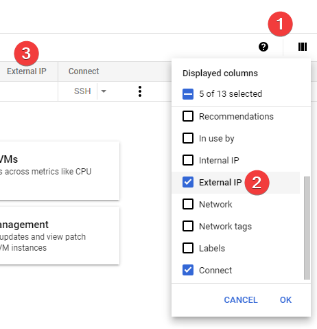
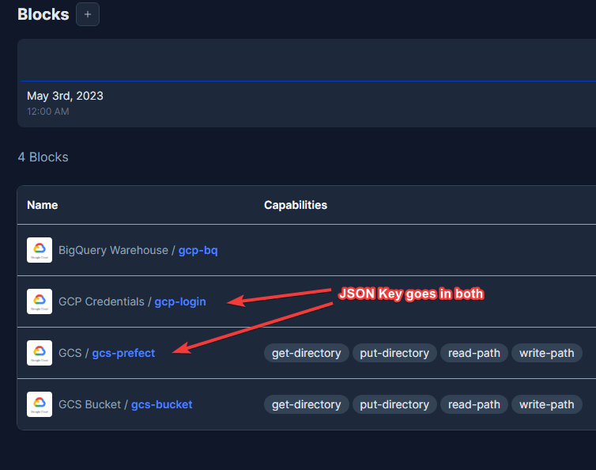
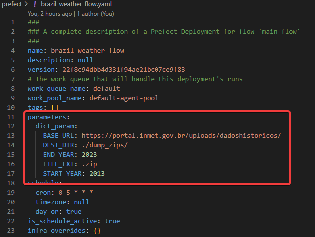

## How to execute my project
As the final capstone, we are supposed to run fellow's projects at our machines. So I'll summarize here how you can run my project. 

You will need a Mac or Linux Machine (like Ubuntu 22.04). Windows folks could use Ubuntu 22.04 at WSL2 without problems.

### Setup Google Cloud Plataform for a new project
1. Access [GCP New Project by clicking here](https://console.cloud.google.com/projectcreate)
1. Define for Project name and for Project ID: `br-weather-your-name`
1. Go to [IAM & Admin >> Service Accounts](https://console.cloud.google.com/iam-admin/serviceaccounts) and create a New Service Account.
    1. Put `admin-svc` in Service account name. 
    2. Assign these roles for your new account:
        - BigQuery Admin
        - Compute Admin
        - Storage Admin
        - Storage Object Admin
        - Viewer
    >For real world projects, you **must** create more granular rules for your service accounts.
    3. At [IAM & Admin >> Service Accounts](https://console.cloud.google.com/iam-admin/serviceaccounts) click over `admin-svc` account.
    4. In the new page, click in KEYS >> [ADD KEYS] >> Create new key >> * JSON >> CREATE
    5. A new file will be downloaded, *keep it safe*, never publish it to public shares (GitHub, PasteBin, etc).
1. For the first use, go to [Compute Engine](https://console.cloud.google.com/compute) and enable *Compute Engine API* in the new page.
1. Setup Google Cloud SDK at your computer ([Item 4 for instructions](https://github.com/DataTalksClub/data-engineering-zoomcamp/blob/main/week_1_basics_n_setup/1_terraform_gcp/2_gcp_overview.md#initial-setup))
1. Setup Terraform at your computer. [Instructions here](https://github.com/DataTalksClub/data-engineering-zoomcamp/blob/main/week_1_basics_n_setup/1_terraform_gcp/1_terraform_overview.md)
1. **OPTIONAL**: configure SSH Key authentication in your project:
    1. At your PC, run this:
        ```bash
        ssh-keygen -t rsa -f ~/.ssh/KEY_FILENAME -C USERNAME -b 2048
        ```
    1. Go to [Compute  Engine >> Metada >> SSH KEYS](https://console.cloud.google.com/compute/metadata)
    1. Click in EDIT >> + ADD ITEM
    1. Copy/Paste at *SSH Key n*** the content of your generated file `~/.ssh/KEY_FILENAME.pub`
    1. To show your VMs External IP:
        - Go back to [Compute Engine](https://console.cloud.google.com/compute)
        - Click *COlumn display options...*
        - Select *External IP*
            <details>
            
            
            </details>
    1. For now, you are able to login to GCP VM with:
        ```bash
        ssh -i ~/.ssh/KEY_FILENAME USERNAME@VM.EXTERNAL.IP
        ```
    1. References: [GPC Docs](https://cloud.google.com/compute/docs/connect/create-ssh-keys#create_an_ssh_key_pair):


### Git Clone Me
It's time to clone this repository to a folder in your PC.
In your shell, run this:
```bash
cd ~
git clone https://github.com/romiof/brazil-weather.git
cd brazil-weather
```

### How to use Terraform
We're going to start Terraform to construct our cloud infrastructure.
At your shell, run this to download all artifacts:
```bash
cd ~/brazil-weather/terraform
terraform init
```
My recipe will setup three GCP object's at "us-west1" / "us-west1-a", to avail GCP Free Tier.
- A Google Cloud Storage Bucket
- A Big Query Dataset
- A Ubuntu 22.04 VM type `e2-medium` **(which charges you about $0.03 hourly)**
> Keep an [eye here](https://cloud.google.com/free/docs/free-cloud-features#free-tier-usage-limits) to see your free tier limits.

Also for the VM, will be created a swap file and all PIP requirements will be installed. Prefect agent will start with VM root user.
Need to use this approach, because all of us are out of GCP 90-days trial, and now, we must pay for some resources 😉

Here how to plan / apply / destroy your cloud resources:
```bash
terraform plan \
    -var="project=your-gcp-project-id" \
    -var="PREFECT_API_KEY=your_prefect_cloud_token_api" \
    -var="PREFECT_WORKSPACE=prefect_cloud/workspace_string"

terraform apply \
    -var="project=your-gcp-project-id" \
    -var="PREFECT_API_KEY=your_prefect_cloud_token_api" \
    -var="PREFECT_WORKSPACE=prefect_cloud/workspace_string"

terraform destroy \
    -var="project=your-gcp-project-id" \
    -var="PREFECT_API_KEY=your_prefect_cloud_token_api" \
    -var="PREFECT_WORKSPACE=prefect_cloud/workspace_string"
```

### Prefect Cloud
Use your Prefect Cloud Key / Workspace to complete above Terraform command variables.
- [API Keys here](https://app.prefect.cloud/my/api-keys)
- [Workspace Settings at main page](https://app.prefect.cloud/)

Now on Prefect Cloud, let's create all needed blocks. <br>
Under `Blocks Menu`, create four itens:
1. GCP Credentials / gcp-login
    - Put `<your-gcp-project-id>` in `Project (Optional)`
    - Copy/Paste the content of [Your GCP Service Account JSON Key](README.md#setup-google-cloud-plataform-for-a-new-project) in `Service Account Info (Optional)`
1. GCS / gcs-prefect
    - Put `bucket-<your-GCP-bucket-name>/flows` in `Bucket Path`
    - Copy/Paste the content of [Your GCP Service Account JSON Key](README.md#setup-google-cloud-plataform-for-a-new-project) in `Service Account Info (Optional)`
1. BigQuery Warehouse / gcp-bq
    - At combo-box, select `gcp-login`
1. GCS Bucket / gcs-bucket
    - Put `bucket-<your-GCP-bucket-name>` in `Name of Bucket`
    - Put `data-lake` in `Bucket Folder`
    - At combo-box, select `gcp-login`

<details>


</details>

### Python, VirtualEnv and Prefect Local
First of all, in your PC:
- Install Python 3.10.x
- Install [VirtualEnv](https://virtualenv.pypa.io/en/latest/)

Then execute this commands to create a new VENV:

```bash
cd ~/brazil-weather
virtualenv venv
source venv/bin/activate
pip install --upgrade pip
pip install -r requirements.txt
```
A VirtualEnv was created at your project folder and all PIP requirements has been downloaded.
Now logon your local Prefect profile to Prefect Cloud.
```bash
cd ~/brazil-weather
prefect cloud login -k <your_prefect_cloud_token_api>
prefect cloud workspace set --workspace <prefect_cloud/workspace_string>
prefect config set PREFECT_API_ENABLE_HTTP2=false
```
> Prefect Agents / Cloud Servers, are having some troubles with *HTTP2*, for this, I suggest you to disable it for a while. [GitHub Issue](https://github.com/PrefectHQ/prefect/issues/7442)

Now let's deploy our flow to Cloud Workspace.
It will use a sub-folder `/flows/`, under GCS Bucket (from Prefect Block), to save our `.py` files.
After that, our `Prefect Agent` will download these files in each flow run.

```bash
cd ~/brazil-weather/prefect
prefect deployment build elt_flow.py:main_flow -n brazil-weather-flow -sb gcs/gcs-prefect -q default --cron "0 5 * * *" -o brazil-weather-flow.yaml
```
My default parameters are a JSON/Dict attributes, and I can't figure how to include them at `deployment build`.
So, please edit the file `brazil-weather-flow.yaml` , under *parameters* key, to include this:
```yaml
parameters:
  dict_param:
    BASE_URL: https://portal.inmet.gov.br/uploads/dadoshistoricos/
    DEST_DIR: ./dump_zips/
    FILE_EXT: .zip
    START_YEAR: 2013
    END_YEAR: 2023
```

<details>


</details>

Now let's apply it to Prefect Cloud, and you will see it at your environment:
```bash
prefect deployment apply brazil-weather-flow.yaml
```
<details>


</details>

This *deployment* has a schedule to run once a day, at UTC 05:00 AM.
<details>


</details>

### dbt Cloud
On dbt website, you need to setup a connections to GCP Big Query and possibly to you own GitHub repo.
So, maybe you need to fork my repo and start from it.

I'll describe my steps to use [dbt Cloud](https://cloud.getdbt.com/)

1. At [Account Setting](https://cloud.getdbt.com/settings/profile), click on *Projects*.
1. I put the name of my project to `Analytics`
1. In Repository, I connected my GH repo to my dbt account.
    - Here you should use a fork, because I'm not sure if you could link to my repo.
1. In Connection, I choose for BigQuery.
    - Upload [Your GCP Service Account JSON Key](README.md#setup-google-cloud-plataform-for-a-new-project)
    - For `Timeout`, insert `300`
    - For `Location`, insert `us-west1`
    - [Reference](https://docs.getdbt.com/docs/cloud/connect-data-platform/connect-bigquery#json-keyfile)
1. Project subdirectory
    - Insert here `dbt` (this link to a folder `dbt` at my repo)

Now, you must create a dbt Environment and after a dbt Job.

1. Go to Deploy >> Environments
    1. \+ Create Environment
    1. In `Name` put `Prod`
    1. In `Environment Type` chose `Deployment`
    1. In `dbt Version Type` chose `1.4 (latest)`
    1. In `Deployment Credentials >> Dataset` put `br_weather`
1. Go to Deploy >> Jobs
    1. \+ Create Job
    1. In `Job Name` put `Job_Br_Weather`
    1. In `Environment` chose `Prod`
    1. In `Commands` clean all and insert two commands:
        - `dbt seed`
        - `dbt run`
    1. In `Triggers >> Schedule` turn on `Run on schedule`
    1. In `Schedule Days` turn on only `Monday`
    1. In `At exact intervals` put `6`
    > My source is refreshed only once a month, so running dbt once a week is enough for the SLA.

    <details>

    
    
    </details>

I started my project using [dimensional modeling](https://www.guru99.com/dimensional-model-data-warehouse.html).

But I don't have enough time to understand in Looker Studio, how can I connect fact and dim tables. <br>
So I change to [OBT](https://www.reddit.com/r/dataengineering/comments/uhohlv/is_kimballs_dimensional_modelling_dead_in_2022_is/), using only one final table in my dashboard.

After run dbt model, the final table is `fact_weather_logs` with almost 30 millions records.

<details>


</details>

### Looker Studio
The final dashboard in [Looker Studio](https://lookerstudio.google.com/reporting/47fbdd9c-7648-45da-8bce-ca84babc3969) can be reproduce with:

1. Setup a [new dashboard](https://lookerstudio.google.com/reporting)
1. Choose BigQuery as Data Source
1. Select `<your-gcp-project-id>`
1. Select dataset `br_weather`
1. Select table `fact_weather_logs`
1. Now, draw like a artist (*not my case* 😁)

<details>


</details>

<details>


</details>

### Epilogue

Dear colleague, I really hope you had success to reproduce my project.

It's not that fancy, but I've learned a lot since the beginning of bootcamp.

All the best for you!